# Component-Level Breakdown (by Screen)

This document outlines container vs presentational components, services, and guards for each of the 13 screens. It references existing components in `src/app/**` and notes planned items (TODO) where relevant.

Legend:
- Rectangles: Components (C = container, P = presentational)
- Parallelograms: Services
- Cylinders: State
- Hexagons: Guards

---

## 1) Landing / Home

```mermaid
flowchart LR
  L[C: LandingShellComponent] --> H[P: HeroSection]
  L --> F[P: FeaturesGrid]
  L --> PR[P: PricingTeaser]
  L --> FT[P: Footer]
  L -.router.-> |/login| LG[P: Login link]
```

Notes: Static content; optional animation directives. No guard.

---

## 2) Authentication (Login / Register / Forgot)

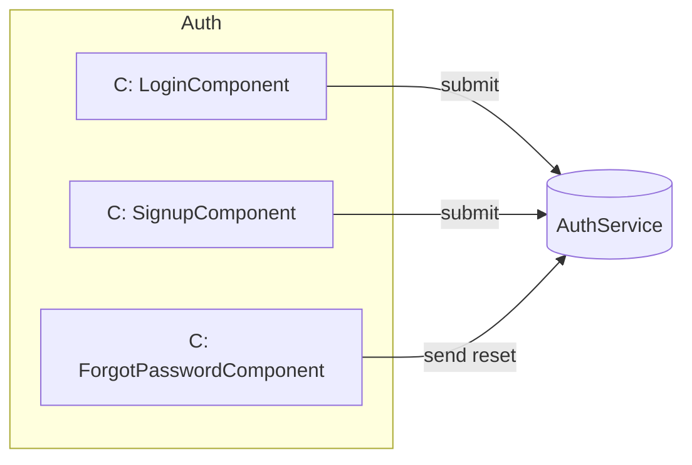

Notes: Uses `AuthService`. Routes are public; success navigates to `/dashboard`.

---

## 3) Dashboard

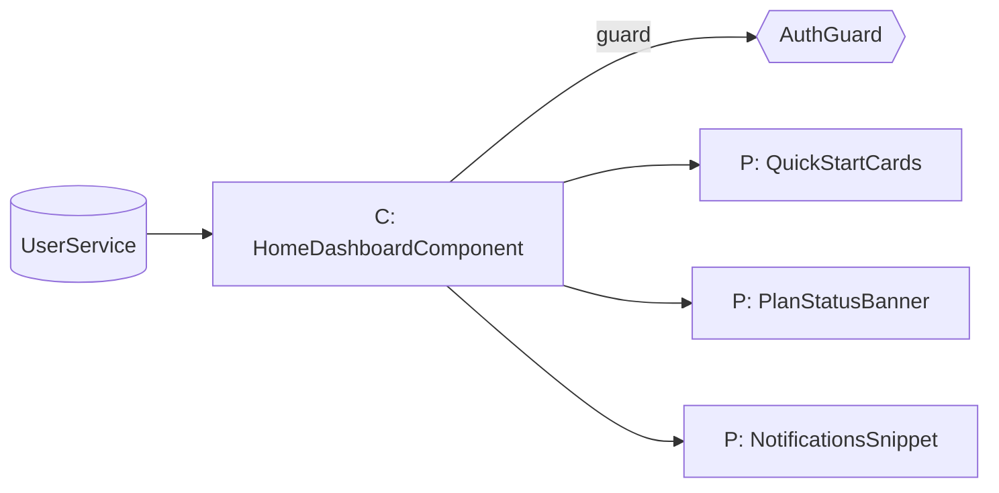

Notes: Guarded by `AuthGuard`. Pulls minimal profile from `UserService`.

---

## 4) Profile & Career Input

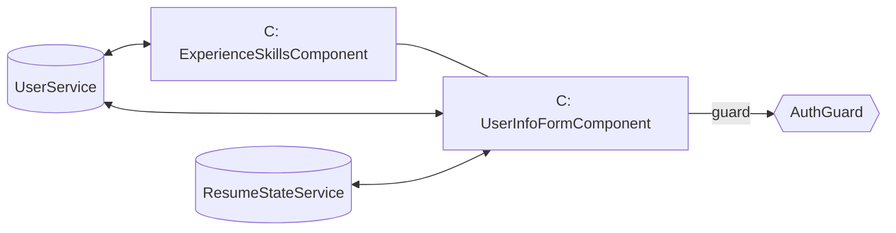

Notes: Reactive forms; save/update to `UserService` (Firestore in future). `ResumeStateService` can hydrate resume fields.

---

## 5) AI Resume Builder

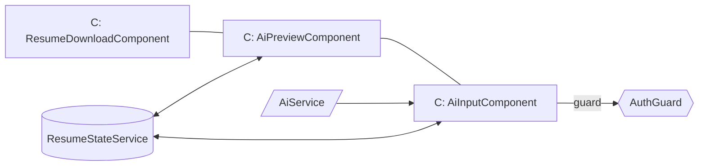

Notes: `AiService` generates content; state stores latest draft; `ResumeDownloadComponent` exports PDF.

---

## 6) AI Cover Letter

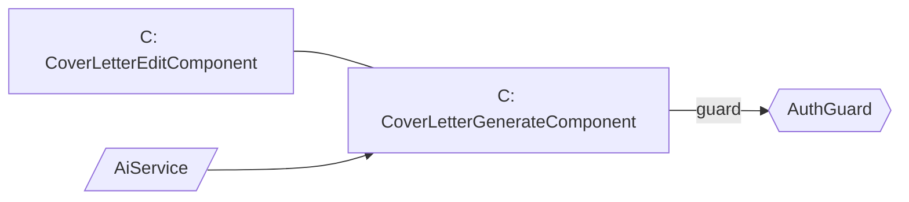

Notes: Similar to resume generation; optional save to profile later.

---

## 7) Job Search & Match

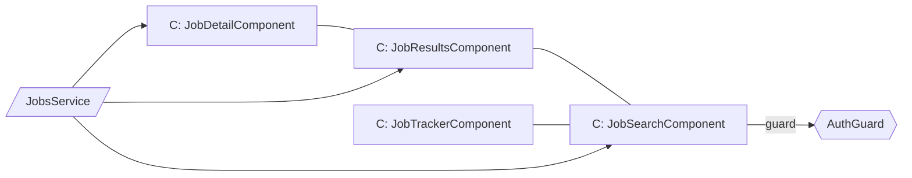

Notes: SSR-safe handling needed for `/jobs/:id` (server-only render or exclude from prerender). `JobTrackerComponent` persists to CRUD later.

---

## 8) Application Tracker

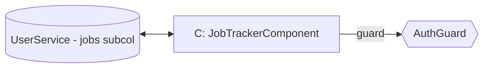

Notes: Will use Firestore CRUD for rows and status updates.

---

## 9) Payment / Subscription

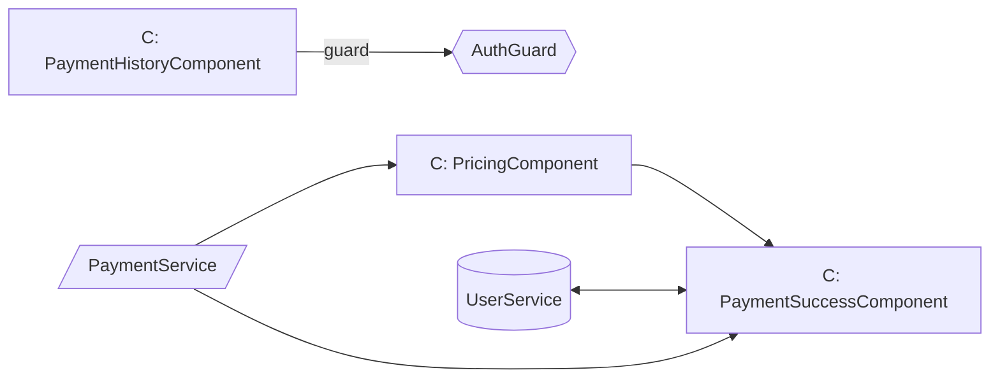

Notes: Razorpay integration via `PaymentService`; success upgrades plan (via `UserService`). A future `SubscriptionGuard` can gate premium features.

---

## 10) Resume Template Gallery

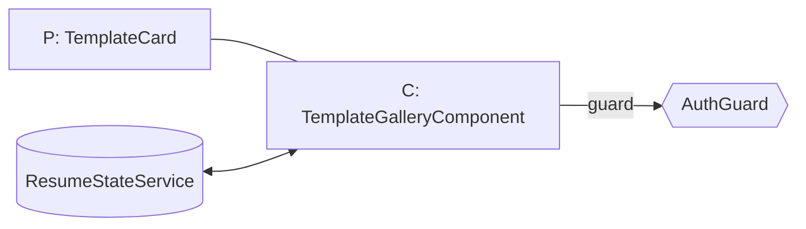

Notes: Gallery feeds preview and selection; chosen template influences preview/download.

---

## 11) Settings / Account

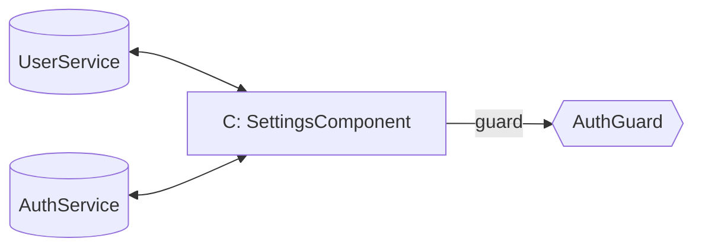

Notes: Update profile basics, change password; optional dark mode toggle stored in profile.

---

## 12) Admin Dashboard

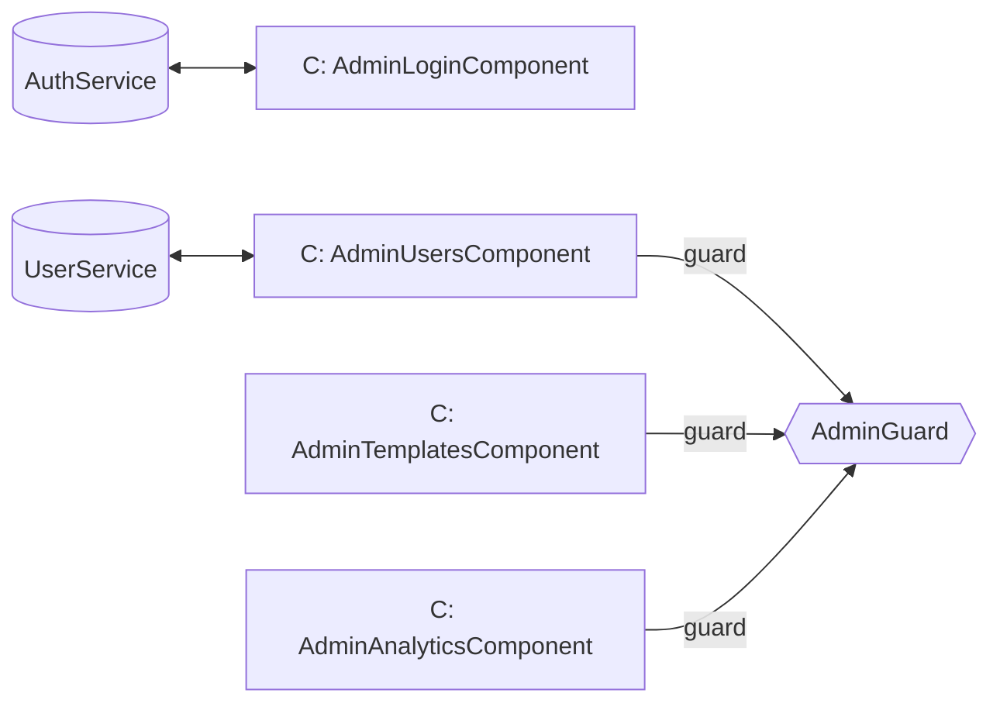

Notes: Separate auth path; admin views require `AdminGuard`.

---

## 13) Help / Support / Contact

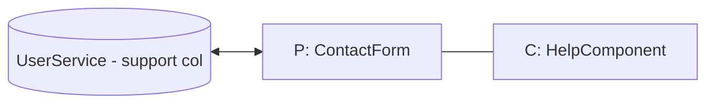

Notes: Public by default; can optionally require auth to prefill user data.

---

## Cross-cutting Services & Modals

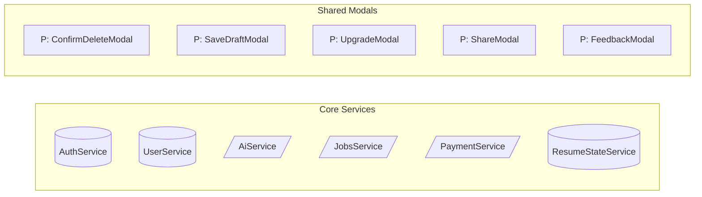

- Modals are invoked via `MatDialog` from feature containers.
- Premium checks: `UpgradeModal` prompts on locked actions when plan is free.

---

## Guarding Strategy

- `AuthGuard`: Required for all authenticated routes (dashboard, profile, resume, cover letter, jobs, settings, payment history).
- `AdminGuard`: Required for admin routes.
- `SubscriptionGuard` (TODO): Gate premium features (advanced templates, AI cover letter, job match). Can piggyback on `UserService` plan status.

---

## Data Notes (high level)

- User: `{ uid, email, name, phone, location, summary, plan, updatedAt }`
- Resume Draft: `{ uid, templateId, blocks, generatedAt }` stored in state and persisted to Firestore later.
- Job Tracker Row: `{ uid, jobId, title, company, appliedAt, status, notes }`.

---

If you want, I can export each diagram as SVG for embedding in docs or a wiki.
