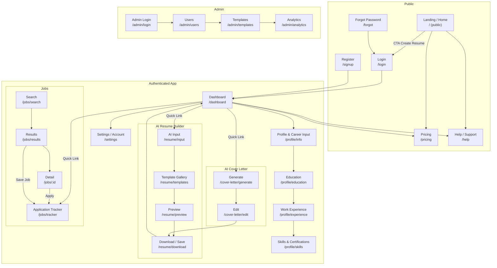

# UI Flow Diagram

This diagram maps the 13 main screens and primary navigation paths for the AI Resume Builder platform.

## Notes
- Routes under "Authenticated App" require AuthGuard. Admin routes require AdminGuard.
- Some premium features (advanced templates, AI cover letter, job match) are gated behind subscription checks.
- Temporary SSR constraint: if prerendering is enabled, parameterized route `/jobs/:id` must be excluded from prerender or provided with `getPrerenderParams`. For now, we can server-render only for that route.
- Export actions create PDFs and optionally save HTML/PDF to Firebase Storage with metadata in Firestore.

## Next
- Confirm naming for education/skills routes you prefer; we can align to your conventions.
- I can also generate wireframe thumbnails for each screen or a component breakdown diagram, on request.
